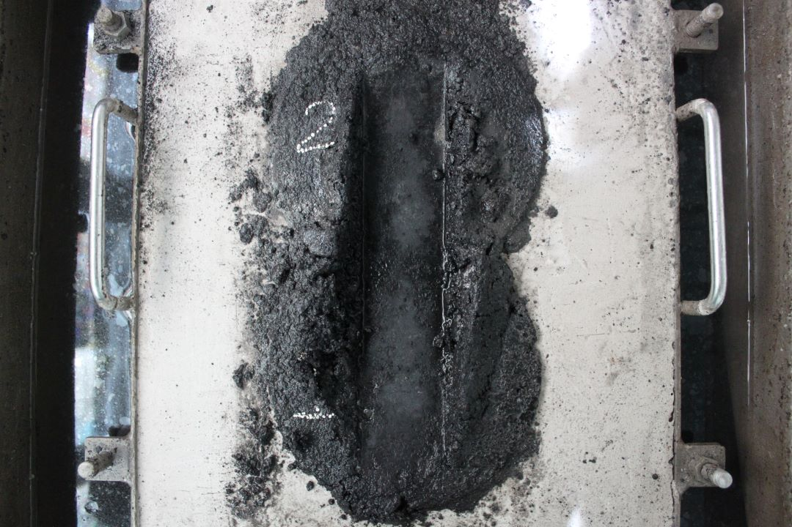

# HWTBench (Hamburg Wheel Tracking on Asphalt Samples Dataset for ML Benchmarking)

## Description: 📝
The HWTBench dataset is a comprehensive collection of asphalt samples tested using the Hamburg Wheel Machine (HWM) across multiple load stages. This dataset has been meticulously generated and curated for benchmarking machine learning applications in asphalt analysis and characterization.

The Hamburg Wheel Machine (HWM) is a well-established testing device specifically designed to simulate the effects of traffic loads on asphalt materials. It applies cyclic loads and wheel abrasion to assess the performance and durability of asphalt samples under various conditions. The dataset contains a wide range of asphalt specimens that have experienced rigorous testing on the HWM, providing diverse scenarios for machine learning evaluation.

The HWTBench dataset offers a valuable resource for researchers, engineers, and data scientists working on machine-learning models for asphalt performance prediction and material analysis. This dataset allows users to develop and validate novel algorithms, models, and asphalt quality assessment and prediction techniques.

## Dataset Title: 😀👌
HWTBench (Hamburg Wheel Tracking on Asphalt Samples Dataset for ML Benchmarking)

## Researchers 🧑‍🔬
- *Dr. José A. Guzmán-Torres*  
jose.alberto.guzman@umich.mx  
https://orcid.org/0000-0002-9309-9390

- *Dr. Luis A. Morales-Rosales*  
lamorales@conacyt.mx  
https://orcid.org/0000-0002-4753-9375

- *Dr. Ignacio Algredo-Badillo*  
lamorales@conacyt.mx  
https://orcid.org/0000-0002-4748-3500

- *Dr. Gerardo Tinoco-Guerrero*  
gerardo.tinoco@umich.mx  
https://orcid.org/0000-0003-3119-770X

- *M.C. Mariana Lobato-Báez*  
gerardo.tinoco@umich.mx  
https://orcid.org/0000-0003-3119-770X

- *M.C. José O. Melchor-Barriga*  
 

## Description of the files: ✍️
The repository contains a directory named Images, which includes the asphalt sample images tested by the HWM. The dataset is divided into two sub-directories, train (899) and test (297). All the images are two-dimensional color images with .jpg extension with high resolution. 

## Definition of acronyms: ✨👨‍💼
HWTBench2023: Hamburg Wheel Tracking Benchmark

## Please cite the following paper if you use this dataset in your research:

@article{  
author = {José A. Guzmán-Torres, Luis A. Morales-Rosales, Ignacio Algredo-Badillo, Gerardo Tinoco-Guerrero, Mariana Lobato-Báez, Jose O. Melchor-Barriga},  
title = {Deep Learning Techniques for Multi-class Classification of Asphalt Damage Based on Hamburg-Wheel Tracking Test Results},  
journal = {Case Studies in Construction Materials},  
year = {2023}
volume = {e02378},  
ISSN ={ISSN 2214-5095}
DOI = {https://doi.org/10.1016/j.cscm.2023.e02378.}
}
